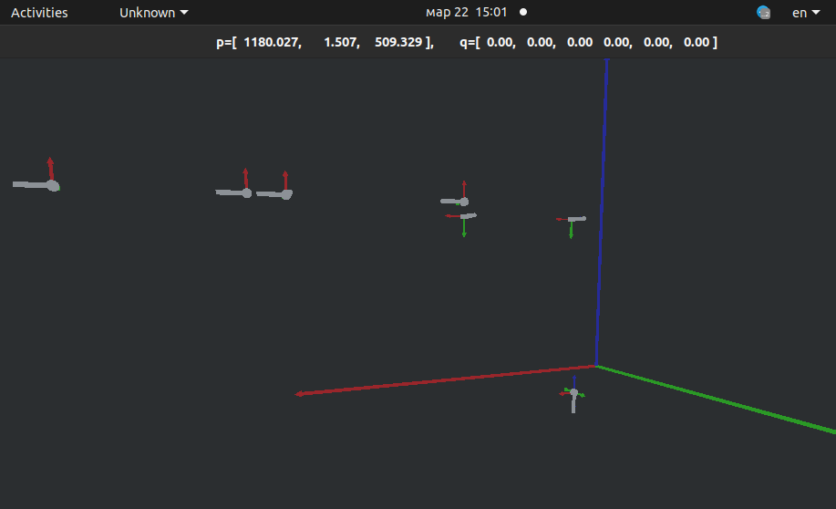
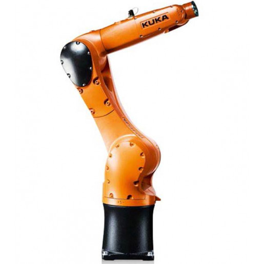

# Визуализация параметров Денавита-Хартенберга

Для составления параметров Денавита-Хартенберга (далее ДХ) реального робота 
недостаточно составить кинематическую схему, требуется совместить 
нулевые точки в звеньях робота. 

Точки отсчёта углов в каждом из сочленений робота не стандартизированы. Поэтому
параметры Денавита-Хертенберга (далее ДХ), составленные по кинематической схеме, могут 
давать значения положения рабочего инструмента, качественно отличные от реальных.

Для определения точек отсчёта и уточнения ДХ параметров была разработана `3D` программа
(с помощью `OpenGL`) визуализации параметров ДХ. 



В заголовке окна выводятся положение энд-эффектора в миллиметрах и углы звеньев в градусах

В модуле `main.cpp` настроены рисование сцены и обработка необходимых событий.
Вся логика работы робота заложена в `robot.cpp`, вспомогательные файлы находятся
в папке `misc`.

Звенья рисуются с помощью `stl`-модели. Синим отображается `z`- координата, 
красным - `x`, зелёным `y`.


Программа была составлена для уточнения ДХ параметров робота `Kuka kr10`. В силу
конструктивных особенностей манипулятора, пришлось ввести виртуальное промежуточное
звено (неуправляемое). Стартовое положение модели совпадает с положением
по умолчанию реального робота.


## Управление



Для перемещения по сцене нужно зажимать кнопки `W`,`S`,`A`,`D` - 
вперёд, назад, влево и вправо соответственно. Для перемещения вверх-вниз
используются кнопки `Q` и `E`.

Управление работает по символам кнопок, поэтому нужно переключиться на английский язык.

Клавиши управление роботом:
- `1` и `2` - поворачивают первое звено
- `3` и `4` - поворачивают второе звено
- `5` и `6` - поворачивают третье звено
- `7` и `8` - поворачивают четвёртое звено
- `9` и `0` - поворачивают пятое звено
- `-` и `=` - поворачивают шестое звено

## Хранение параметров


С помощью аргумента командной строки можно указать путь к
параметрам Денавита-Хартенберга. По умолчанию программа загружает
параметры робота `Kuka kr10` из файла `../dh_params/kr10.json`

Каждое звено робота описывается четырьмя параметрами Денавита-Хартенберга
и флагом, является ли оно невиртуальным, т.е. управляемым. Это связано с тем, что 
ДХ параметры иногда требуют ввести промежуточные, виртуальные звенья.

При хранении в программе параметры ДХ представляют из себя вектор векторов.
Каждый из вложенных векторов имеет длину 5, в первых
четырёх элементах хранятся параметры ДХ, в пятом - текущий угол поворота звена

Пример файла параметров:

```json
{
  "name": "Reduced Kuka KR-10",
  "links": [
    {
      "name": "base",
      "theta": 0,
      "d": 0,
      "a": 0,
      "alpha": 3.14,
      "virtual": true
    },
    {
      "name": "joint-1",
      "theta": 0,
      "d": -475,
      "a": 25,
      "alpha": 1.57,
      "virtual": false
    },
    {
      "name": "joint-2",
      "theta": 0,
      "d": 0,
      "a": 315,
      "alpha": 0,
      "virtual": false
    }
  ],
  "jointInitValues":[
    74.57, -135.69
  ]
}
```

## Зависимости

Приложение использует следующие библиотеки: `GLUT`, `Eigen3`, `jsoncpp`

Чтобы их установить в `Ubuntu`, выполните следующие команды:

```
sudo apt-get update
sudo apt-get install libglu1-mesa-dev freeglut3-dev mesa-common-dev libeigen3-dev libjsoncpp-dev
```

